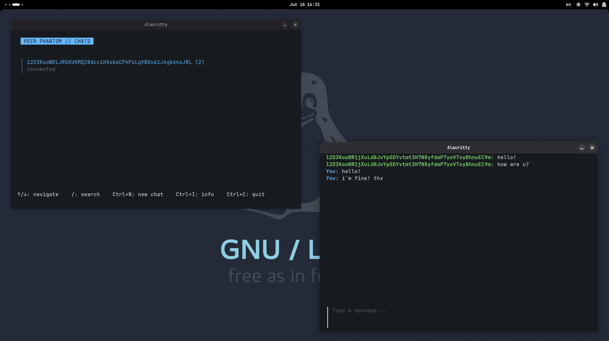

# PEER PHANTOM

## About

**PEER PHANTOM** is a decentralized, anonymous peer-to-peer messenger featuring end-to-end encryption and a terminal-based user interface. This project was developed as part of a **Bachelor's Thesis** in the field of Cybersecurity. Its primary objective is to demonstrate the practical application of modern cryptographic protocols and decentralized networking to achieve complete communication privacy.



## Architecture

To adhere to the principles of clean architecture and separation of concerns, the application is split into **3 isolated layers**: 

1. **Network Layer:** *Handles the entire P2P transmission and network routing logic.* Manages the cryptographic security suite: identity key pair generation, node authentication, and direct e2ee. 

2. **TUI Layer:** *Implements the interactive, text-based user interface directly in the terminal.* Built using the **Bubbletea** library to ensure a smooth, responsive, and aesthetically pleasing terminal experience. 

3. **Definitions Layer:** *A pure boundary layer containing shared data types, communication structures, and interfaces.* Acts as a strict bridge enabling data exchange between the **Network** and **TUI** layers without tightly coupling them.

## Build & Run

A Makefile is provided to simplify the compilation and containerization process.

**Local Build**

Compile the binary by specifying your desired target folder:

```bash
make build-app BINARY_PATH=path/to/your/folder
```

Run the compiled binary by passing your IP and port as environment variables:

```bash
IP=your_ip PORT=your_port path/to/binary/peer-phantom
```

**Docker (Demonstration Mode)**

```bash
make docker-build
make docker-run PORT=your_port
```

**Security Note (Docker):** When executed inside a Docker container, all ephemeral data, including your generated private key and local session logs, will be **permanently deleted** along with the container as soon as you quit the application. This ensures a completely amnesic, secure environment for demonstration purposes.
